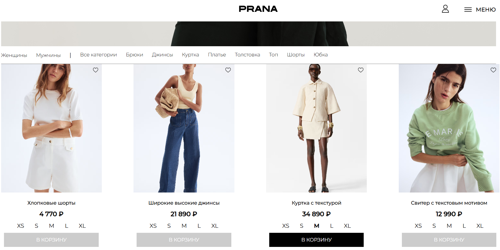
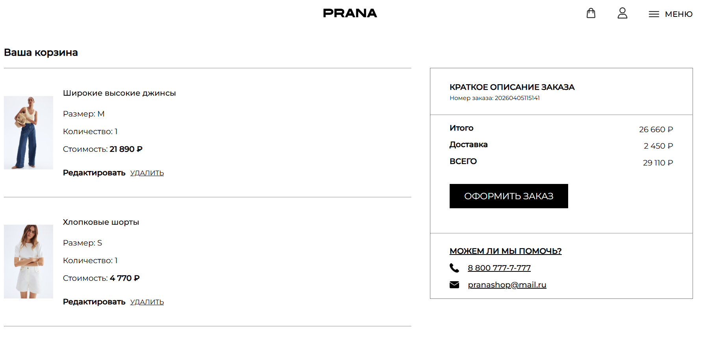
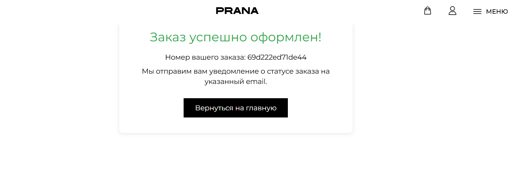
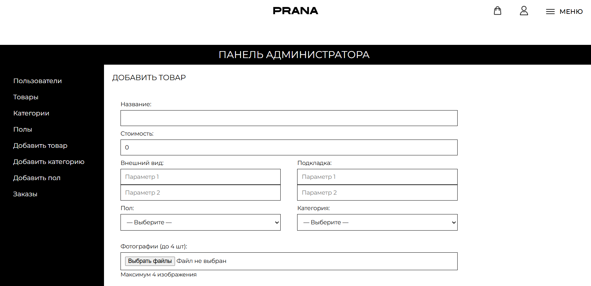

# Prana — интернет-магазин итальянской одежды

## Описание проекта
Prana — это интернет-магазин итальянской одежды, реализованное на PHP.  
Проект предназначен для отображения каталога товаров и работы с данными через серверную логику.

## Функционал
- вывод каталога товаров из базы данных  
- отображение карточек товаров  
- хранение и вывод изображений товаров  
- серверная обработка данных  
- модульная структура проекта  

## Стек технологий
- PHP  
- MySQL  
- HTML  
- CSS  

## Установка и запуск

1. Склонировать репозиторий:

    git clone https://github.com/nooxlovee/prana.git

2. Перейти в папку проекта

3. Создать базу данных в MySQL 

4. Настроить подключение к БД  
   (в конфигурационном файле проекта)

5. Запустить проект через локальный сервер:
   - OpenServer  
   - XAMPP  
   - MAMP  

6. Открыть в браузере:

    http://localhost/prana

## Скриншоты

